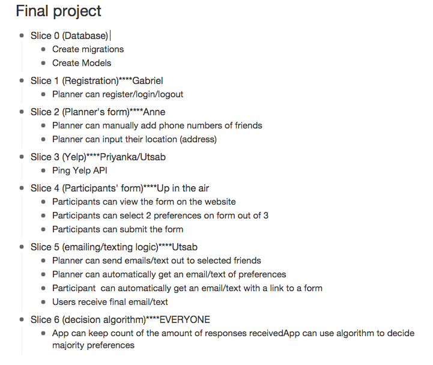

# Restaurant Roulette
Allowing groups to make a quick restaurant choice. Every member of the group gets to vote on two specific preferences for a restaurant (example: affordable, vegetarian options, accepts credit cards, etc). App will take the majority preferences into consideration and return a random restaurant from the pre-filtered pool of restaurants.

## [Schedule](./project_guide/schedule.md)

## [Individual Goals](./project_guide/individual_goals.md)

## [Project Goals](./project_guide/project_mvp_nth.md)

## [Project Planning](./project_guide/planning.md)

## [Slice](https://workflowy.com/s/rtvlppbKxh)

## [Git Workflow](https://gist.github.com/mikelikesbikes/ccbf4c7fd90e647138c6)
###Set Up

<ul>
  <li>Single repo which everyone else clones</li>
  <li>Checkout onto “development-branch” and make branches named after your slice</li>
</ul>

###BEFORE Pushing steps:

Did you write tests? Did those tests pass? Did you make a team annoucment about pushing? Did you show your team that your slice/feature works?

<ul>
  <li>git co development-branch</li>
  <li>git fetch origin</li>
  <li>git merge origin/development-branch</li>
  <li>git co my-slice-branch</li>
  <li>git merge development-branch</li>
</ul>

###Push
<ul>
  <li>git push origin my-slice-branch</li>
</ul>

