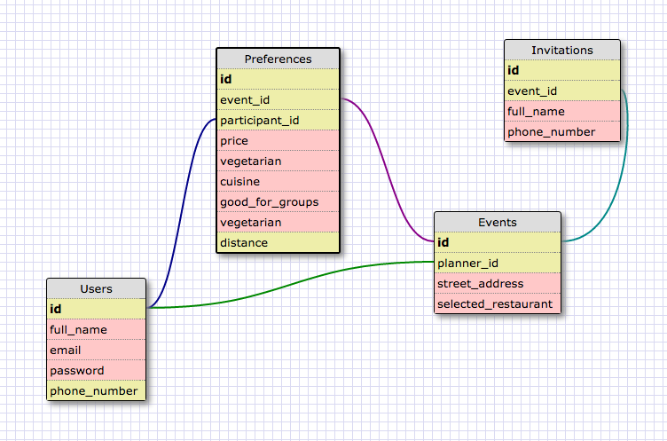

#Planning

##User Stories
Planner::
<ul>
  <li>A planner can register/login/logout</li>
  <li>A planner can view/Add phone numbers of friends</li>
  <li>A planner can select friends by their name/alias</li>
  <li>A planner can send texts out to selected friends</li>
  <li>A planner can input requested restaurant location (City and State)</li>
  <li>A planner can automatically get a text with a link to a form</li>
</ul>

Friend::
<ul>
  <li>A friend can view a text with a link to a form</li>
  <li>A friend can select 2 preferences on the form out of a total of 5</li>
  <li>A friend can submit a form</li>
</ul>

Users::
<ul>
  <li>Both planner and friends can receive a text with the decided restaurant details</li>
</ul>

## Technologies
For Minimal Viable Product:
<ul>
  <li><a href="http://guides.rubyonrails.org/">Ruby on Rails</a></li>
  <li><a href="https://github.com/Yelp/yelp-ruby">Yelp API</a></li>
  <li><a href="https://www.twilio.com/docs/api">Twilio</a></li>
  <li><a href="https://github.com/yhordi/testing-and-code-coverage/tree/construction">Testing Selenium</a></li>
</ul>
Nice to Have:
<ul>
  <li>Meteor - make into phone app</li>
  <li>Bootstrap - frontend</li>
  <li>Heruko - deployment</li>
</ul>

##Schema Design

